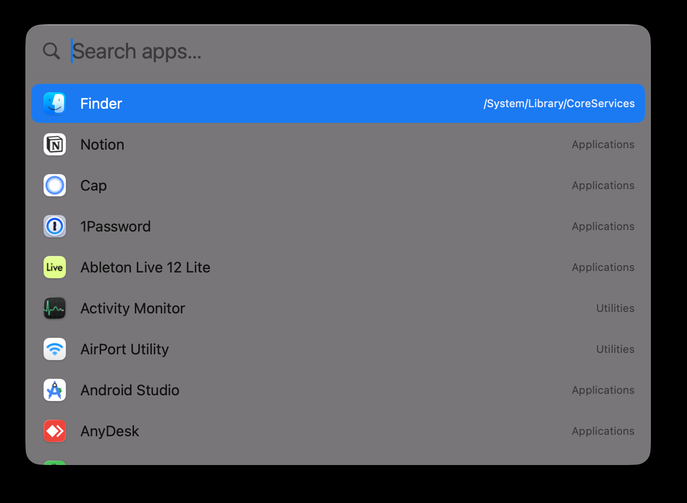

# Launcher

A minimal, fast macOS app launcher. Click the dock icon, type, press enter. That's it.



## Why

macOS Launchpad was removed in Tahoe. Spotlight does too much. Raycast/Alfred are overkill for "just open an app". This is ~500 lines of Swift that does one thing well.

- **Fast.** Cold start < 30 ms, search < 1 ms per query, 180+ apps indexed.
- **Fuzzy search.** `ntn` → Notion. `fndr` → Finder. `saf` → Safari.
- **Keyboard layout aware.** Accidentally typed `тщешщт` on the Russian layout? Finds Notion.
- **Recents.** Apps you open often rank higher.
- **Auto-reindex.** FSEvents watcher — new apps appear without relaunching.
- **No dependencies.** Pure Swift + SwiftUI + AppKit.

## Install

### From release

Download the latest `.zip` from [Releases](https://github.com/hormold/launcher/releases), unzip, drag `Launcher.app` to `/Applications`.

First launch: right-click → **Open** (ad-hoc signed, Gatekeeper needs the override once).

### From source

Requires macOS 14+, Xcode command-line tools.

```bash
git clone https://github.com/hormold/launcher.git
cd launcher
bash build.sh --install --run
```

## Usage

- Click the dock icon → search field is focused, type → **Enter** opens top match.
- **↑** / **↓** — navigate results.
- **Esc** — hide the window.
- Search looks in `/Applications`, `~/Applications`, `/System/Applications`, Utilities, Setapp, CoreServices/Applications, and Finder.

## Pin to dock

After first launch, right-click the dock icon → **Options** → **Keep in Dock**.

## Build flags

```
bash build.sh                 # just build .app
bash build.sh --run           # build + launch
bash build.sh --install       # build + copy to /Applications + refresh Dock
bash build.sh --sign          # build + code-sign with first identity in keychain
bash build.sh --install --run # full dev loop
```

To sign with a specific identity:

```
bash build.sh --sign="Developer ID Application: Your Name (TEAMID)"
```

## CLI modes

The binary has hidden diagnostic modes that run without UI:

```
Launcher --probe "notion"    # show top 10 matches + variants
Launcher --self-test         # run scenario test suite
Launcher --bench             # scan + search timing
Launcher --integrity         # verify indexed apps still exist
```

## Architecture

| file | role |
| --- | --- |
| `LauncherApp.swift` | `@main`, window lifecycle, dock-reopen handling |
| `AppIndex.swift`    | `/Applications` scan, cache, FSEvents watcher |
| `FSWatcher.swift`   | `FSEventStream` wrapper for auto-reindex |
| `SearchEngine.swift`| fuzzy scorer: exact > prefix > word > substring > subsequence |
| `KeyboardLayout.swift`| QWERTY ↔ ЙЦУКЕН key-position swap |
| `Recents.swift`     | `UserDefaults`-backed MRU list |
| `ContentView.swift` | SwiftUI search UI + keyboard nav |
| `main.swift`        | entry point + CLI flag handling |

Index cached to `~/Library/Caches/Launcher/index.json`. Recents in `UserDefaults` under `launcher.recents`.

## Not planned

- Global hotkey (dock click is the trigger — one mental model).
- Plugin system.
- Web search / calculator / clipboard history.
- Window management.

If you want those, use Raycast.

## License

MIT.
